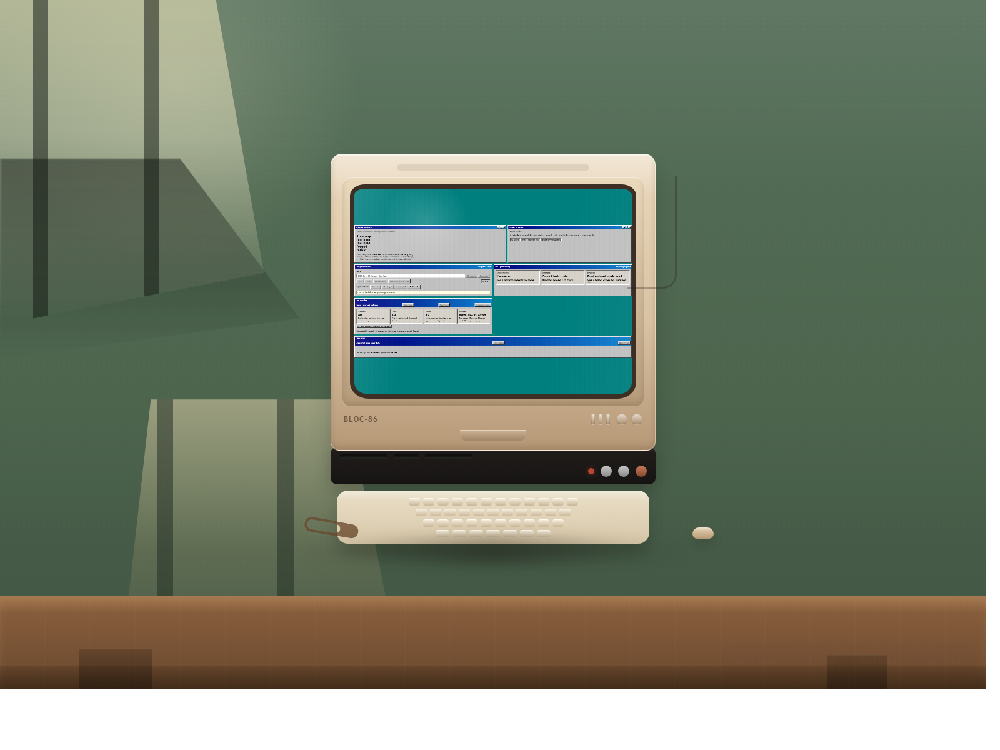
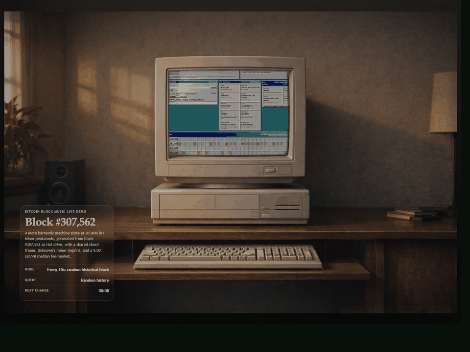

# Bitcoin Block Board Music

[Portfolio notes and demo guidance](PORTFOLIO.md)

Public demo: <https://bidkern.github.io/bitcoin-block-board-music/stream.html?demo=1>

A local-first browser app that turns Bitcoin block data into deterministic,
board-generated music using JavaScript, Web Audio, and custom browser-side
visual systems.





This repository is best understood as a runnable creative coding system, not
just a static code sample. A Bitcoin block becomes a repeatable composition,
performance surface, and visual artifact.

## Fastest demo path

1. Install dependencies:

```bash
npm install
```

2. Start the local app:

```bash
npm start
```

3. Open the local URLs:

- Main composer and analysis view: `http://127.0.0.1:4173`
- Cinematic live-demo route: `http://127.0.0.1:4173/stream.html?demo=1`

The demo route rotates through random historical Bitcoin blocks every 10
seconds. The main view is where you can inspect the score, freeze the live
monitor, step through beats, mute tracks, switch sound palettes, and export
WAVs.

## What this is

This is not a block explorer with sound effects layered on top. It is a
deterministic music system where Bitcoin block structure becomes:

- harmony
- tempo
- rhythmic fingerprint
- lead phrasing
- drone movement
- timbre and texture

The result sits somewhere between instrument, sequencer, data artwork, and
presentation demo.

## Architecture

The project works as a pipeline:

1. Load a Bitcoin block by height, hash, or latest tip.
2. Derive a deterministic fingerprint from its metadata and transactions.
3. Map that fingerprint into form, harmony, rhythm, accents, and timbre.
4. Render the composition with browser-side synthetic voices rather than large prerecorded audio.
5. Expose the result through a UI built for auditioning and inspection.

Full system notes live in [ARCHITECTURE.md](ARCHITECTURE.md).

## How Bitcoin block data maps to sound

- Block height sets the tonal center and large-scale form.
- Transaction ids create the rhythmic fingerprint.
- Detailed transaction data drives lead-note pitch, accents, note length, and dynamics.
- Weight and size shape density and tempo.
- Nonce adds swing and stereo drift.
- Merkle root drives the fast pulse line.
- Previous block hash drives the drone intervals.
- Bits and difficulty color the synthetic timbre.
- Fee behavior and miner identity influence descriptor flavor and performance character.

## Experience features

- Randomized live demo scene for quick portfolio review
- Main workstation UI for block-by-block exploration
- Deterministic block-to-score generation
- Per-track mute and solo controls
- Freezeable live monitor with beat stepping
- Click-to-inspect sequencer workflow
- Alternate sound-profile switching
- WAV export
- Keyboard transport controls
- OBS-style presentation scene

## Live and broadcast experience

The repository includes two complementary surfaces:

1. `index.html`
   The main analysis and composition workstation.

2. `stream.html`
   A cinematic "broadcast" wrapper around the core app that makes the project
   easier to understand in a portfolio or screen-recorded setting.

For streaming or recorded walkthroughs, you can also run:

```bash
npm run broadcast
```

Detailed setup notes live in [OBS_SETUP.md](OBS_SETUP.md).

## Desktop launch

Double-click `Bitcoin Block Music.vbs` for the cleanest app-style launch on
Windows.

If you want a visible console while it starts, double-click
`Bitcoin Block Music.cmd` instead.

## Verification

Lightweight checks used for this project:

```bash
npm install --dry-run --ignore-scripts --no-audit --no-fund
node --check app.js
node --check stream.js
node --check server.js
```

## GitHub Pages workflow

A GitHub Pages workflow is present at `.github/workflows/deploy-pages.yml`.

Public homepage / demo URL:

`https://bidkern.github.io/bitcoin-block-board-music/stream.html?demo=1`

Recommended repository homepage field:

`https://bidkern.github.io/bitcoin-block-board-music/stream.html?demo=1`

## Suggested GitHub topics

- `javascript`
- `bitcoin`
- `web-audio`
- `generative-music`
- `creative-coding`
- `data-art`
- `browser-app`
- `github-pages`

## License

[MIT](LICENSE)

